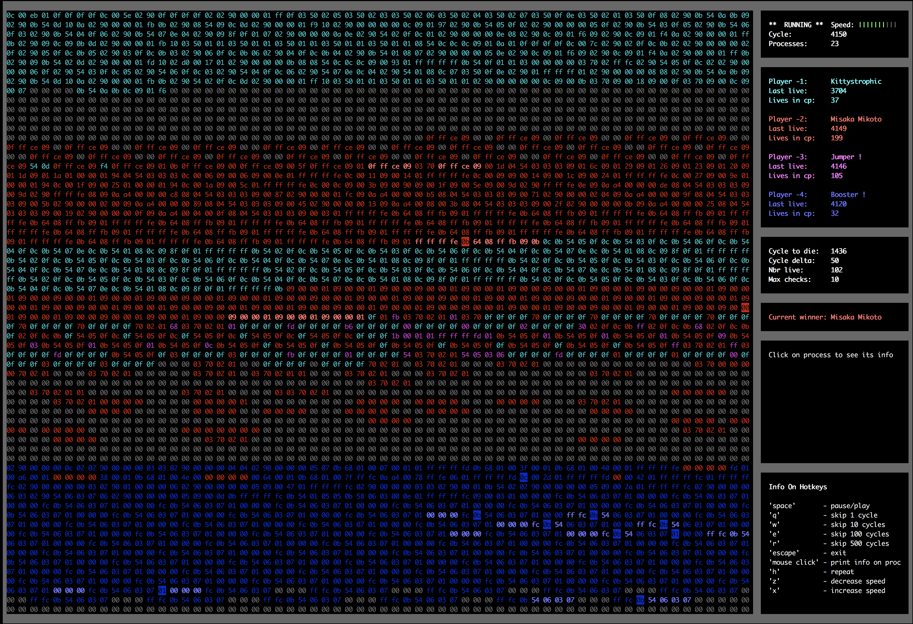

# 42-corewar
## Algorithmic project

### This project can be broken down into three distinctive parts:
* The assembler: this is the program that will compile your champions and translate
them from the language you will write them in (assembly language) into “Bytecode”. Bytecode
is a machine code, which will be directly interpreted by the virtual
machine.

* The virtual machine: It’s the “arena” in which your champions will be executed.
It offers various functions, all of which will be useful for the battle of the champions.
Obviously, the virtual machine should allow for numerous simultaneous processes;
we are asking you for a gladiator fight, not a one-man show simulator.

* The champion: This one is a special case. Later, in the championship, you will
need to render a super powerful champion, who will scare the staff team to death.
However, rendering this kind of champion is serious work. And since, for now, we
are mostly interested in your capacity to create Corewar’s other programs (i.e. the
assembler and virtual machine), your current champion will only need to prove to
us that you can write bits and pieces of Corewar ASM. This means that the champion
you should render for this project only needs to scare the bejesus out of a
neurasthenic hedgehog.

All functions are created in accordance with Norm - the bunch of rules how code should be formatted.

**!NOTE**  
Because of 42 School norm requirements:  
* All variables are declared and aligned at the top of each function  
* Each function can't have more then 25 lines of code  
* C++ style code commenting is forbidden  
* Project should be created just with allowed functions otherwise it's cheating.  

#### More about School 42 you can find here: https://en.wikipedia.org/wiki/42_(school).
